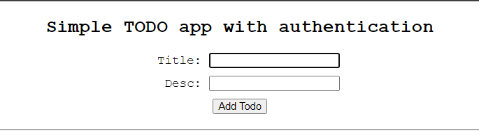

# Simple TODO App with Authentication



This is a simple TODO application with user authentication built using Express.js, MongoDB, and vanilla JavaScript for the frontend.

## Table of Contents

- [Features](#features)
- [Technologies Used](#technologies-used)
- [Setup Instructions](#setup-instructions)
- [Usage](#usage)
- [Endpoints](#endpoints)
- [Frontend](#frontend)
- [Security Considerations](#security-considerations)
- [Contributing](#contributing)
- [License](#license)

## Features

- User authentication with JWT tokens.
- Add, retrieve, and delete TODO items.
- Minimalistic frontend for managing TODOs.

## Technologies Used

- **Backend:**
  - **Express.js**: A fast, unopinionated, minimalist web framework for Node.js, providing robust features for building web applications and APIs.
  - **MongoDB**: A NoSQL database used for storing TODO items and user information.
  - **Mongoose**: An Object Data Modeling (ODM) library for MongoDB and Node.js, providing a straightforward schema-based solution to model application data.
  - **JSON Web Tokens (JWT)**: Used for user authentication and authorization.

- **Frontend:**
  - **Vanilla JavaScript**: Used for DOM manipulation and handling API requests.
  - **HTML**: For structuring the frontend components.
  - **CSS**: For minimal styling of the frontend elements.

## Setup Instructions

1. **Clone the Repository:**
   ```bash
   git clone https://github.com/notnotdurgesh/ToDoApp.git
   ```

2. **Install Dependencies:**
   ```bash
   cd todo-app
   npm install
   ```

3. **Set Environment Variables:**
   - Define the following environment variables:
     - `MONGODB_URI`: MongoDB connection URI.
     - `SECRET_KEY`: Secret key for JWT token generation.

4. **Start the Server:**
   ```bash
   npm start
   ```

## Usage

- After setting up the server, navigate to `http://localhost:3000` in your web browser.
- You can sign up using a username and password.
- Once signed up, you can add new TODO items, view existing ones, and mark them as completed.
- TODO items are stored in the MongoDB database.

## Endpoints

- **POST /signup**: Allows users to sign up and generates a JWT token upon successful signup.
- **POST /add**: Adds new TODO items. Requires authentication using JWT token.
- **GET /getall**: Retrieves all TODO items. Requires authentication.
- **DELETE /deleteOne/:itemId**: Deletes a specific TODO item by its ID. Requires authentication.

## Frontend

- The frontend of the application provides a simple interface for managing TODO items.
- Users can add new items by providing a title and description.
- Existing items are displayed with an option to mark them as completed or delete them.

## Security Considerations

- Ensure to keep the `SECRET_KEY` secure and never expose it publicly.
- Implement proper error handling and validation to prevent security vulnerabilities.
- Use HTTPS for secure communication between the frontend and backend in production environments.

## Contributing

Contributions are welcome! If you'd like to contribute to this project, please fork the repository and create a pull request with your changes.

## License

This project is licensed under the [Apache License 2.0](LICENSE).

